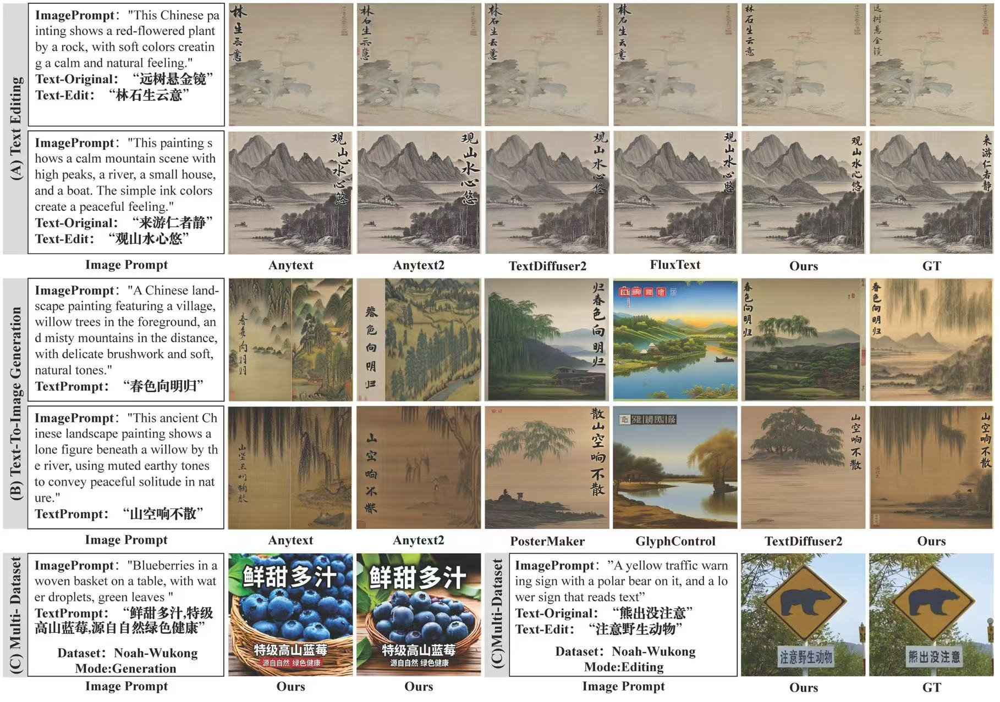
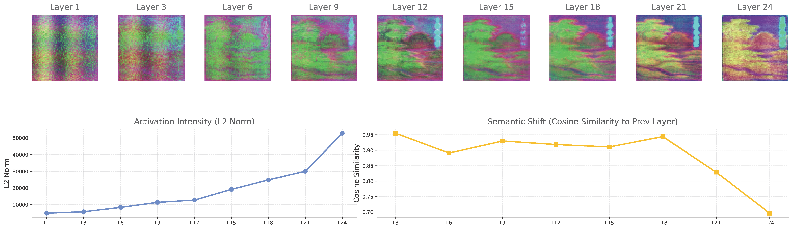

# CalliEdit: Dual-Stream Flow Matching with Feature Osmosis for Topologically-Preserved Image-Text Generation and Editing

[](https://opensource.org/licenses/MIT) []() [](https://pytorch.org/)

## 📖 Introduction

**CalliEdit** proposes an innovative Dual-Stream Flow Matching architecture, integrated with a Feature Osmosis mechanism and differentiable sequence reward feedback based on CTC-driven topological correction. It enables high-fidelity text rendering under extreme artistic deformation and seamless image-text editing in complex backgrounds. This method not only achieves strict orthogonal disentanglement among global layout, topological skeleton, and calligraphic style, but also provides a highly robust unified paradigm for topology-preserving generation in open-domain scenarios.

## 📢 Open Source Status

⚠️ **Important Notice: This paper is currently under review.**

To comply with academic standards, all specific quantitative comparison results, such as accuracy, FID, and other evaluation scores, have been hidden in this document.

* 🔓 **Inference and Training Code**: The code has been fully open-sourced. You can reproduce our model architecture and data flow through this repository.
* 🔒 **Pre-trained Model Weights**: Pre-trained weights such as Calliscape-S, along with part of the dataset, will be released immediately after the paper is officially accepted.

## 🌟 Qualitative Results

> Note: The following images demonstrate the qualitative generation and editing results of CalliEdit in various complex scenarios.

### 1. Comparative Experiments

We compare CalliEdit with state-of-the-art visual text generation models, such as AnyText, under diverse artistic styles, complex layouts, and scene editing tasks.



*Figure 1: CalliEdit significantly outperforms existing methods in preserving calligraphic artistic style and achieving better background integration.*

### 2. Ablation Studies

Ablation studies are conducted to validate the contribution of each model component to background consistency and the integrity of text topological structures.


*Figure 2: Visualization of generation differences before and after ablation.*

### 3. Feature Map Evolution Analysis

To further investigate the internal mechanism of the model, we visualize the evolution of feature maps in the denoising trajectory of the dual-stream architecture. This analysis reveals how textual features are progressively integrated into the background domain through the osmosis mechanism.



*Figure 3: Response variations of the feature osmosis layers at different timesteps, demonstrating the progressive disentanglement and reconstruction of layout and details.*

## ⚙️ Installation

This project is built upon core libraries such as PyTorch and Diffusers. We recommend using Conda to configure the virtual environment.

```bash
# 1. Create and activate the Conda environment
conda create -n calliedit python=3.10 -y
conda activate calliedit

# 2. Install PyTorch 
# The following example uses CUDA 11.7. Please align it with requirements.txt.
pip install torch==2.0.0+cu117 torchvision==0.15.0 -f https://download.pytorch.org/whl/cu117/torch_stable.html

# 3. Install the remaining dependencies
pip install -r requirements.txt
```

---

## 🚀 Getting Started

### 🎨 Inference

After downloading the `stable-diffusion-3-medium-diffusers` base model and our open-source ControlNet weights, you can run inference using the following command to generate images with customized text or perform region-based text editing:

```bash
#!/bin/bash
# Run the inference script to generate images with customized text
# or perform region-based text editing

python inference.py \
 --pretrained_model_path='' \
 --TWN_path='' \
 --CPN_path='' \
 --seed=42 \
 --num_images_per_prompt=4 \
 --use_float16
```

### 🏋️ Training

The training process of CalliEdit consists of two disentangled stages: **Stage 1: TextWriteNet Training**, which focuses on text topology and text rendering, and **Stage 2: CanvasPriorNet Training**, which focuses on global layout and feature osmosis-based scene fusion. We provide a one-click sequential training script.

**Stage 1: TextWriteNet Training**

```bash
torchrun --nproc_per_node=2 --master_port=29500 train_stage1.py \
 --pretrained_model_path='' \
 --TWN_path='' \
 --output_dir=./checkpoints_training --name=calliedit_stage1 \
 --mixed_precision=fp16 --learning_rate=1e-4 --num_train_epochs=30 --train_batch_size=8 \
 --resolution_h=1024 --resolution_w=1024 --checkpointing_steps=500
```

**Stage 2: CanvasPriorNet Training**

```bash
# Note: path should point to the latest checkpoint generated from Stage 1 training.

torchrun --nproc_per_node=2 --master_port=29501 train_stage2.py \
 --pretrained_model_name_or_path='' \
 --TWN_path=.pth \
 --CPN_path=.pth \
 --output_dir=./checkpoints_training --name=calliedit_stage2 \
 --mixed_precision=fp16 --learning_rate=1e-4 --num_train_epochs=30 --train_batch_size=2 \
 --resolution_h=1024 --resolution_w=1024 --bg_inpaint
```

## 📜 Citation & Acknowledgments

If you find our work helpful for your research or open-source projects, please consider citing our paper:

```bibtex
@article{
}
```

## 📧 Contact

For any questions about the code, academic discussions, or open-source collaboration, please feel free to open an issue on GitHub.
